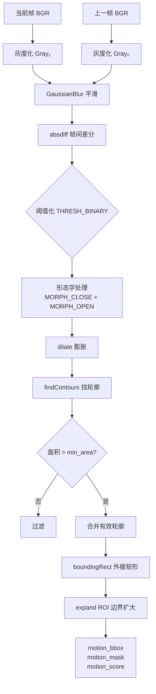

# 实验报告素材

以下内容可直接整理进课程设计报告或答辩 PPT。

## 一、项目背景

手语是听障群体与健听人群交流的重要方式。传统手语识别方法常依赖人工特征或单一分类模型，存在泛化能力不足、实时演示能力弱、结果难以被中文用户直接理解等问题。本项目基于 YOLOv11 目标检测模型，构建多类别手语识别与无障碍交流辅助 Web 系统，实现手语区域检测、中文语义映射、实时识别和评估分析。

## 二、技术路线

```text
YOLO 格式数据集
        ↓
数据集统计与质量检查
        ↓
YOLOv11 迁移训练
        ↓
验证集评估与图表生成
        ↓
统一 Web 推理服务
        ↓
图片 / 批量 / 视频 / 摄像头演示
        ↓
中文语义展示、短语拼接、置信度趋势
```

## 三、系统创新点

| 方向 | 具体体现 |
| --- | --- |
| 模型能力 | 使用 YOLOv11n 完成 35 类手语目标检测 |
| 工程能力 | Flask Web 作为统一演示入口，后端复用模块化推理服务 |
| 评估能力 | 展示真实验证指标、类别分布、类别均衡和混淆矩阵 |
| 实时交互 | ROI、稳定窗口、重复去抖、短语编辑和置信度趋势 |
| 协作能力 | 数据集、训练输出和运行输出不进 Git，保留默认演示权重 |

## 四、实验设置

- 模型：YOLOv11n
- 权重：`weights/yolov11_best.pt`
- 类别数：35
- 训练集：2148 张图片，2148 个标注框
- 验证集：210 张图片，210 个标注框
- 输入尺寸：640
- 验证设备：NVIDIA GeForce RTX 4060 Laptop GPU

说明：当前 `test` 配置复用 `val`，因此实验结论按验证集结果表述。

## 五、实验结果

| 指标 | 数值 | 含义 |
| --- | ---: | --- |
| Precision | 0.9730 | 预测为某类的目标中，真正正确的比例 |
| Recall | 0.9831 | 真实目标中被成功检测出的比例 |
| mAP@0.5 | 0.9834 | IoU=0.5 下的平均检测精度 |
| mAP@0.5:0.95 | 0.7986 | 更严格 IoU 区间下的综合检测精度 |

图表素材：

- `new-shoyuDetection/static/analysis/metrics_summary.png`
- `new-shoyuDetection/static/analysis/class_distribution.png`
- `new-shoyuDetection/static/analysis/class_balance_top_bottom.png`
- `new-shoyuDetection/static/analysis/confusion_matrix.png`
- `new-shoyuDetection/static/analysis/confusion_matrix_normalized.png`

## 六、结果分析

模型在验证集上取得较高 Precision 和 Recall，说明对当前数据集中的手语动作具有较好的检测能力。mAP@0.5 达到 0.9834，表示在较常用的定位阈值下，模型能够稳定识别多数类别。mAP@0.5:0.95 为 0.7986，说明在更严格定位条件下仍有提升空间，尤其现场摄像头中的光照、手部遮挡和动作边界会进一步影响框定位质量。

类别分布图显示训练集中不同类别样本数量并不完全均衡，样本较少类别包括 `you/your/this`、`please`、`I/me` 等。后续如果继续提升泛化能力，应优先补充少样本类别和真实摄像头场景样本。

## 七、答辩表达口径

可以这样概括项目贡献：

本项目从数据集、模型训练、评估分析到 Web 演示形成完整闭环。相比只做离线图片识别，本系统把 YOLOv11 检测结果接入 Web 端，并增加 ROI、稳定窗口、重复去抖和短语拼接，使其更接近真实无障碍交流辅助系统原型。同时，评估页展示真实验证指标和高清图表，增强了项目的可解释性和课程完成度。

## 八、局限与改进

- 当前 test 配置复用 val，后续应拆分独立测试集。
- 数据集主要来自既有标注图片，真实摄像头场景泛化仍需补充自采样本。
- 当前短语拼接基于规则窗口，后续可结合时序模型或语言模型提升语义连贯性。
- 手语识别只覆盖 35 个类别，后续可扩展更多常用词和连续手语表达。

## 九、公共服务窗口应用场景

### 9.1 场景描述

本系统定位为**公共服务窗口中的无障碍手语辅助交流系统**，典型应用场景包括：

| 场景 | 描述 | 痛点 |
| --- | --- | --- |
| 医院导诊台 | 听障患者通过手语向护士描述症状 | 医护人员不懂手语，沟通困难 |
| 政务服务大厅 | 听障人士办理证件、咨询业务 | 材料填写、业务指引需反复确认 |
| 校园服务中心 | 听障学生咨询选课、奖助学金 | 信息传递效率低 |
| 银行柜台 | 听障客户办理开户、转账等业务 | 身份核实、业务确认缺乏实时反馈 |
| 社区事务中心 | 听障居民咨询政策、申请补贴 | 文字沟通耗时，窗口压力大 |

### 9.2 系统工作流程

```
听障用户（手语）
        ↓
摄像头实时采集画面
        ↓
YOLOv11 手语检测 + 帧差运动区域增强
        ↓
中文语义映射
        ↓
语音播报（服务人员听）
   +  屏幕文字显示（双方看）
   +  短语拼接（长句理解）
        ↓
服务人员响应 / 确认
```

### 9.3 场景特点与算法约束

- **实时性要求高**：公共服务窗口通常只有数秒响应时间，需保持 15+ FPS
- **背景复杂**：服务大厅光照不均、人员走动多，需要运动区域增强过滤背景误检
- **手部动作幅度小**：导诊台等场景中用户可能只是轻微抬手，帧差阈值需适当调低
- **多用户切换**：需支持滑动窗口投票机制，避免环境干扰导致的误识别

### 9.4 推荐参数配置

| 场景 | 帧差阈值 | 最小面积 | 模式 |
| --- | ---: | ---: | --- |
| 医院导诊台（光线稳定） | 20 | 150 | motion_roi |
| 政务大厅（人员走动多） | 30 | 300 | motion_filter |
| 校园服务中心（背景简单） | 25 | 200 | motion_roi |
| 通用（默认） | 25 | 200 | baseline |

---

## 十、帧间差分运动区域增强算法

### 10.1 算法原理

帧间差分法（Frame Differencing）是经典的运动目标检测方法。其核心思想是：比较相邻两帧图像的像素差异，当某区域像素值变化超过阈值时，认为该区域存在运动。

在公共服务窗口场景中，手语动作的本质是手部相对于背景的位移。传统整图检测的问题在于：
- 背景中的光线变化、人员走动会产生误检
- 整图推理对远处小目标不敏感
- 计算开销大，难以在低配置设备上实时运行

帧差法通过"上一帧减去下一帧"锁定变化区域：
- 静态背景在连续帧中差异接近 0，被消除
- 手部运动区域像素值变化显著，被保留
- 仅在运动区域内执行 YOLO 推理，大幅减少计算量

### 10.2 算法流程



### 10.3 三种检测模式对比

| 模式 | 流程 | 优点 | 缺点 | 适用场景 |
| --- | --- | --- | --- | --- |
| baseline | YOLO 整图检测 | 无额外开销，稳定可靠 | 背景干扰多 | 背景简单、光照稳定 |
| motion_roi | 帧差 → 裁剪 ROI → ROI 内检测 | 减少背景误检，计算快 | 可能漏检慢速动作 | 背景复杂、用户动作明显 |
| motion_filter | YOLO 整图检测 → 运动区域过滤 | 不漏检，精度高 | 计算开销略大 | 需要高召回率 |

### 10.4 时序滑动窗口投票机制

单帧检测结果容易受噪声影响产生误识别。为此系统引入滑动窗口投票机制：

```
帧1:  检测到 "help"
帧2:  检测到 "help"
帧3:  误检为 "yes"  ← 噪声
帧4:  检测到 "help"
帧5:  检测到 "help"

窗口 = 5，投票阈值 = 3

"help" 出现 4 次 → 票数 4 >= 3 → 稳定输出 "help"
"yes" 出现 1 次 → 票数 1 < 3 → 被过滤
```

参数说明：
- `vote_window`：滑动窗口大小，太大延迟高，太小容易受噪声影响
- `vote_threshold`：投票通过阈值，必须 > 窗口大小的一半

### 10.5 关键参数调优建议

| 参数 | 默认值 | 调大（更严格） | 调小（更敏感） |
| --- | ---: | --- | ---: |
| diff_threshold | 25 | 减少误检，但可能漏掉慢速动作 | 捕获更多运动，但增加噪声 |
| min_area | 200 | 过滤小抖动误检 | 保留更多细节，但可能引入噪声 |
| expand_ratio | 0.3 | 避免裁剪到手部边缘 | 减少背景干扰，但可能漏边缘 |
| blur_size | 5 | 减少高频噪声 | 保留更多运动细节 |

---

## 十一、对比实验模板

### 11.1 消融实验设计

针对帧差增强模块，设计以下对比实验：

| 实验编号 | 模式 | 帧差阈值 | 最小面积 | 投票窗口 | 投票阈值 |
| --- | --- | ---: | ---: | ---: | ---: |
| Exp-1 | baseline | - | - | - | - |
| Exp-2 | motion_roi | 25 | 200 | 5 | 3 |
| Exp-3 | motion_filter | 25 | 200 | 5 | 3 |
| Exp-4 | motion_roi | 20 | 150 | 5 | 3 |
| Exp-5 | motion_roi | 30 | 300 | 5 | 3 |

### 11.2 评估指标

| 指标 | 计算方式 | 含义 |
| --- | --- | --- |
| 检测次数 | 有效检测帧数 | 召回能力 |
| 平均置信度 | Σ(conf) / 检测次数 | 精确度代理 |
| 空检测帧比例 | 空帧数 / 总帧数 | 漏检率代理 |
| 平均 FPS | 总帧数 / 推理耗时 | 实时性 |

### 11.3 实验结果模板

#### 11.3.1 视频对比结果

| 模式 | 检测次数 | 平均置信度 | 空检测帧比例 | 平均 FPS |
| --- | ---: | ---: | ---: | ---: |
| baseline | - | - | - | - |
| motion_roi | - | - | - | - |
| motion_filter | - | - | - | - |

#### 11.3.2 公共窗口场景对比

| 场景 | baseline 检测率 | motion_roi 检测率 | motion_filter 检测率 | 推荐模式 |
| --- | ---: | ---: | ---: | --- |
| 医院导诊台 | - | - | - | - |
| 政务服务大厅 | - | - | - | - |
| 校园服务中心 | - | - | - | - |

#### 11.3.3 参数敏感性分析

不同帧差阈值下的 motion_roi 性能（min_area=200）：

| 帧差阈值 | 检测次数 | 平均置信度 | 空检测帧比例 | FPS |
| ---: | ---: | ---: | ---: | ---: |
| 15 | - | - | - | - |
| 20 | - | - | - | - |
| 25 | - | - | - | - |
| 30 | - | - | - | - |
| 35 | - | - | - | - |

### 11.4 运行评估脚本

```bash
# 基本用法
python scripts/evaluate_demo_video.py --video demo.mp4

# 指定参数
python scripts/evaluate_demo_video.py \
    --video demo.mp4 \
    --conf 0.5 \
    --diff-threshold 25 \
    --min-area 200 \
    --output-csv outputs/csv/motion_ablation.csv \
    --output-fig outputs/figures/motion_ablation.png

# 批量测试多个视频
for video in datasets/test_videos/*.mp4; do
    python scripts/evaluate_demo_video.py --video "$video"
done
```

### 11.5 局限性说明

- 帧差法基于灰度差异，对光照突变敏感，建议在光照稳定的室内场景使用
- motion_roi 模式在用户动作幅度较小时可能检测不到运动区域，会自动退化为 baseline
- motion_filter 模式计算开销略高于 baseline，需注意实时性
- 当前帧差仅使用相邻两帧（t 与 t-1），可扩展为三帧差分（t、t-1、t-2）以减少"鬼影"现象
